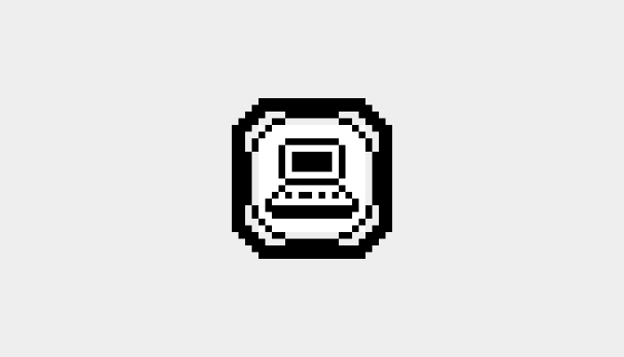

# Brick 1100 Builders

__Builders__ is a short name for an advanced program available in [Brick 1100](./about.md). It offers a set of tools and features that allow you to create your own apps and games, and seamlessly integrate them with Brick 1100. You can publish your creations and share with other Brick 1100 users, and even earn rewards for your work. The owners of these creations are referred to as _builders_.

## Understanding how it works

### The nature of Brick 1100

> _Recommended read: [Turning my CodePen into an actual app](../blog/from-codepen-to-app.md)._

Despite being a mobile app, Brick 1100 at its core is developed using web techs (HTML, CSS, and JavaScript). Ignoring the technical details, this means you can create your own apps and games using the same techs, which subjectively have a lower entry barrier if you are new to programming, or easier and faster to work with if you are already familiar with them.

Web techs offer a powerful [iframe](https://developer.mozilla.org/en-US/docs/Web/HTML/Element/iframe) feature that allows embedding web content within web content. This is the key for how Brick 1100 works: it embeds your apps and games within its own interface, providing a seamless experience for the user.

The diagram above illustrates how your apps and games are integrated with Brick 1100 using iframe.

### Bridge 1100

> _Learn more: [Bridge 1100 GitHub repository](https://github.com/Visnalize/bridge-1100)_

Bridge 1100 is a small JavaScript utility that acts as a bridge between your apps/games and Brick 1100. It provides an API that allows your creation to exchange events and data from and to Brick 1100 such as `start`, `stop`, `keypress`, `numpress` etc. In addition, it comes with a set of predefined styles to make your creation fit seamlessly with Brick 1100's interface effortlessly.

### Previewer

> _Learn more: [Using Brick 1100 Previewer](./builders/using-previewer.md)_

Previewer is a tool that allows you to test your apps and games on Brick 1100 prior to publishing. It leverages Bridge 1100 under the hood to provide a realistic preview of how your creation will look and behave on Brick 1100. This is useful for debugging and ensuring your creation works as expected once published.

<SponsorAd />

## Quick start

Below are the general steps to start building your own apps and games and publish them to Brick 1100. We are going to use [Visual Studio Code](https://code.visualstudio.com/), a recommended code editor as it offers a wide range of features and extensions, including this [Live Server](https://marketplace.visualstudio.com/items?itemName=yandeu.five-server) extension that enhances your development experiences.

### 1. Setup

- Install [Visual Studio Code](https://code.visualstudio.com/).
- Install the [Live Server](https://marketplace.visualstudio.com/items?itemName=yandeu.five-server) extension in Visual Studio Code.
- Create a [GitHub](https://github.com/) account if you don't have one.
- Go to a directory repository:
  - [Brick 1100 Apps](https://github.com/Visnalize/brick-1100-apps) if you are building an app.
  - [Brick 1100 Games](https://github.com/Visnalize/brick-1100-games) if you are building a game.
- Fork the repository to your account.
- Clone the forked repository to your Visual Studio Code.

### 2. Build

- In your Visual Studio Code, create a new folder and name it as your app's name.
- Write your app's code in the folder (you can refer to the existing apps for examples).
- Once done, commit and push your code to your forked repository.

### 3. Publish

- Create a pull request to original directory repository.
- Your pull request will be reviewed by the maintainers
  - This step is mandatory to ensure the quality and security of the apps/games before getting published to Brick 1100 users.
- Once approved, your pull request will be merged and your app will be available in Brick 1100 immediately.

## In-depth guides

Depending on what you are building, you can follow the respective in-depth guides below for detailed step-by-step instructions:

- [Building an app](./builders/building-app.md)
- [Building a game](./builders/building-game.md)

## Best practices

When building your apps and games, it is important to follow the best practices to ensure the quality and security of your creations. Check out the guide below for more details:

- [Best practices](./builders/best-practices.md)

## Support

Feel free to leave a comment or reach out on [Discord](https://discord.com/invite/6AQDnZa4Xm) if you need help or have any questions.
