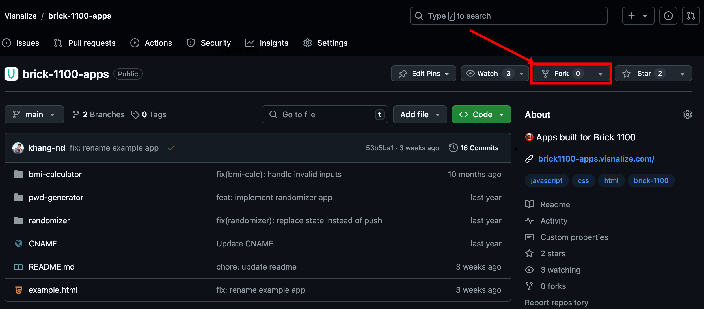
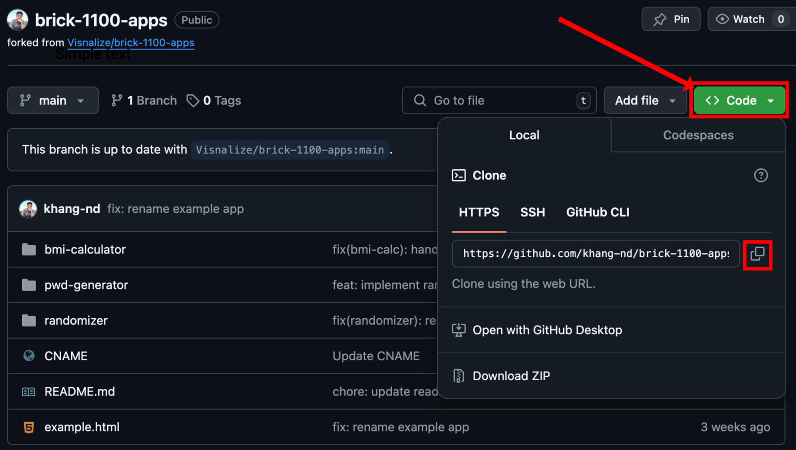
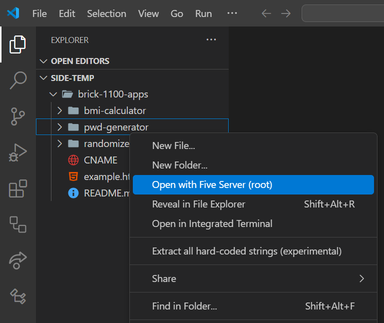
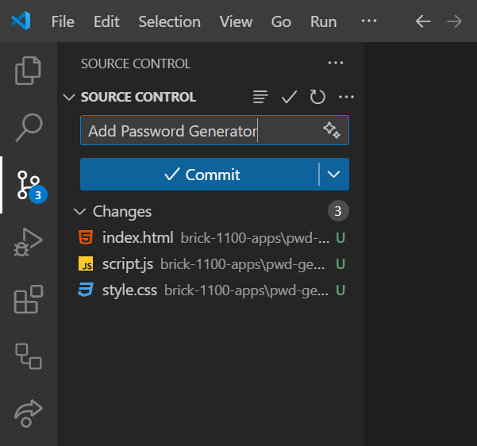
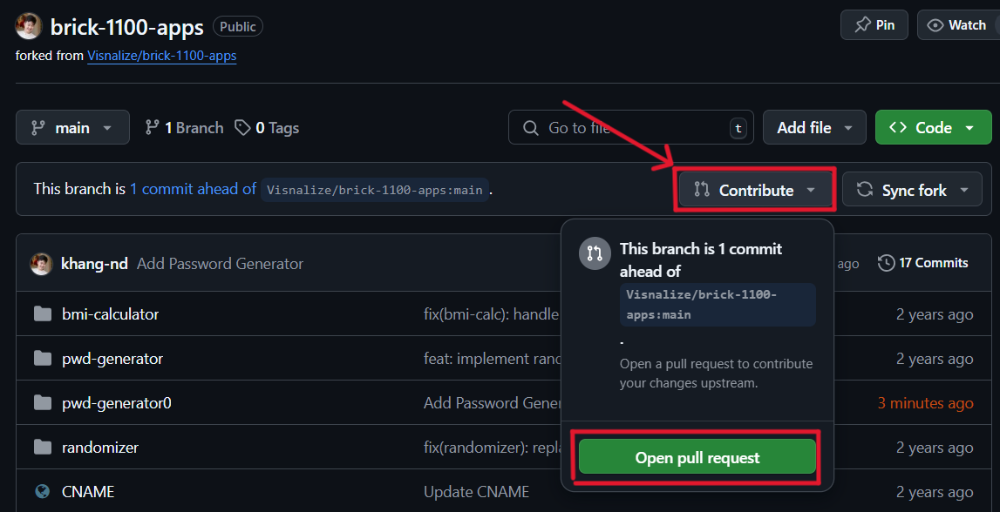
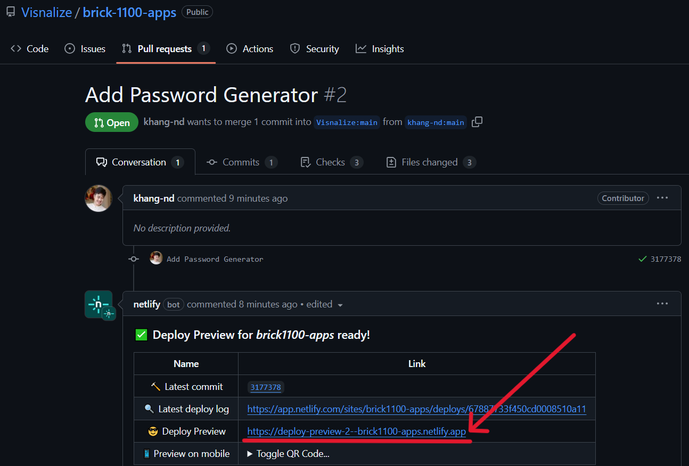

# Building an app for Brick 1100

:::tip Note
It is recommended to read the [Introduction](../builders.md) first to understand the background of Brick 1100, how it works, and the related tools before continuing with this guide.
:::

In this guide, let's build a simple __Password Generator__ app and get it running on [Brick 1100](../about.md).

This Password Generator app will generate a random password based on the user's input for the length of the password (maximum 30 characters). Below is a preview of the final app:

<video playsinline autoplay loop muted controls :class="$style.video">
    <source src="./img/pwd-generator.mp4" type="video/mp4">
</video>

<SponsorAd />

## 1. Setup

### 1.1. Tool

- Install [Visual Studio Code](https://code.visualstudio.com/) on your device.
  - This is the recommended code editor for this guide.
- Install the [Live Server](https://marketplace.visualstudio.com/items?itemName=yandeu.five-server) extension in Visual Studio Code.
  - This extension will help you to run your app locally and see the changes in real-time.
- After the above steps, you should see a `Go Live` button at the bottom right corner of Visual Studio Code.


### 1.2. Codebase

- Create a [GitHub](https://github.com/) account if you don't have one.
- Fork the [Brick 1100 Apps](https://github.com/Visnalize/brick-1100-apps) directory repository to your account.
  - This repository contains the source code of all apps built for Brick 1100. Your app will be added to this repository upon completion.



- Clone the forked repository to your Visual Studio Code:
  - Copy the repository URL as shown in the below screenshot.
  
  - In Visual Studio Code, open the terminal (select `View > Terminal` from the menu or press <code>Ctrl + `</code>) and run the following command:

    ```bash
    git clone <repo_url>
    ```

  - Replace `<repo_url>` with the copied URL, e.g. `https://github.com/<username>/brick-1100-apps.git`.

- Once the repository is cloned, you will see the source code in your Visual Studio Code.

<SponsorAd />

## 2. Build

- In your Visual Studio Code, create a new folder named `pwd-generator` inside the `brick-1100-apps` folder. This folder will contain the source code of the Password Generator app.
- Start the Live Server by selecting the `pwd-generator` folder, right-clicking, and selecting `Open with Five Server (root)`.



- A new browser tab with the URL `http://127.0.0.1:5500` will open, now every change you make to this folder will be reflected in real-time.

### 2.1. App structure (HTML file)

- Create an `index.html` file inside the `pwd-generator` folder with the below content:

```html:line-numbers {6,7,24}
<!DOCTYPE html>
<html>

<head>
    <title>Password Generator</title>
    <link rel="stylesheet" href="https://unpkg.com/bridge-1100/dist/index.css">
    <link rel="stylesheet" href="https://unpkg.com/bridge-1100/dist/font.css">
    <link rel="stylesheet" href="style.css">
</head>

<body>
    <div class="screen">
        <label>Password length</label>
        <div id="input"></div>
        <footer>Generate</footer>
    </div>

    <div class="screen" hidden>
        <span>Your password:</span>
        <div id="output"></div>
        <footer>OK</footer>
    </div>

    <script src="https://unpkg.com/bridge-1100/dist/index.umd.js"></script>
    <script src="script.js"></script>
</body>

</html>
```

- The app consists of two screens:
  1. The first screen is for the user to input the length of the password.
  2. The second screen displays the generated password.
- Note the highlighted lines:
  - Line 6 and 7: these are links to the [Bridge 1100](../builders.md#bridge-1100) CSS and fonts files, they help enforce your app's interface to fit seamlessly with Brick 1100's monochrome visual.
  - Line 24: this is a link to the Bridge 1100 JavaScript file, it helps bridge the communication between your app and Brick 1100.

:::danger [Best practice](./best-practices.md)
__Bridge 1100__ should be used in your app to maintain the visual consistency of your app with Brick 1100 and to ensure the app works correctly without having to invent the communication logic between your app and Brick 1100.
:::

### 2.2. App logic (JS file)

- Create a `script.js` file inside the `pwd-generator` folder. In this file, we will write the logic for the Password Generator app.
- From the HTML structure above, we retrieve the input and output elements:

```js
var input = document.getElementById("input");
var output = document.getElementById("output");
```

- Then define the character set for the password generation and a variable for storing the generated password:

```js
var charset = "abcdefghijklmnopqrstuvwxyzABCDEFGHIJKLMNOPQRSTUVWXYZ0123456789!@#$%^&*()-_=+";
var password = "";
```

- Next, we will leverage [Bridge 1100](../builders.md#bridge-1100) to listen for `keypress` and `numpress` events to handle the user's input:

```js
window.bridge.on("keypress", handleKeypress);
window.bridge.on("numpress", handleKeypress);
```

- We implement the `handleKeypress` handler function as below:

```js
function handleKeypress(key) {
  if (typeof key === "number" && input.textContent.length < 2) {
    input.textContent += key;
  }

  if (key === "clear") {
    if (input.textContent.length > 0) {
      input.textContent = input.textContent.slice(0, -1);
    } else {
      stop();
    }
  }

  if (key === "ok") {
    if (input.textContent.length > 0 && !password) {
      generatePassword();
    } else {
      stop();
    }
  }
}
```

- Let's break down the above implementation:
  - The `handleKeypress` function accepts a `key` argument, this is provided by Bridge 1100 when a key is pressed on Brick 1100. For more information, refer to [Bridge 1100 documentation](https://github.com/Visnalize/bridge-1100#keycallback).
  - When the user presses a _number_ key, the password length is updated in the input field. The input length is limited to 2 characters.
  - When the user presses the _Clear_ key, the password length input is reduced by 1 character. If the input is empty, the app calls the `stop` function.
  - When the user presses the _OK_ key, if the password length input is available and the password is not yet generated, the app calls the `generatePassword` function, otherwise, the `stop` function is called.

- The `generatePassword` function generates a random password based on the user's input for the length of the password. If the password length exceeds 30 characters, the app calls the `stop` function. We implement it as below:

```js
function generatePassword() {
  var length = parseInt(input.textContent);

  for (var i = 0; i < length; i++) {
    var randomIndex = Math.floor(Math.random() * charset.length);
    password += charset.charAt(randomIndex);
  }

  if (password.length > 30) {
    return stop({ error: "Out of range" });
  }

  input.parentElement.hidden = true;
  output.parentElement.hidden = false;
  output.textContent = password;
}
```

- The `stop` function resets the password and sends a message to Brick 1100 to close the app. We implement it as below:

```js
function stop(data) {
  password = "";
  window.bridge.send(window.parent, { event: "stop", data: data });
}
```

- Putting it all together, the `script.js` file should look like this:

:::details Click to open

```js
var input = document.getElementById("input");
var output = document.getElementById("output");
var charset = "abcdefghijklmnopqrstuvwxyzABCDEFGHIJKLMNOPQRSTUVWXYZ0123456789!@#$%^&*()-_=+";
var password = "";

window.bridge.on("keypress", handleKeypress);
window.bridge.on("numpress", handleKeypress);

function handleKeypress(key) {
  if (typeof key === "number" && input.textContent.length < 2) {
    input.textContent += key;
  }

  if (key === "clear") {
    if (input.textContent.length > 0) {
      input.textContent = input.textContent.slice(0, -1);
    } else {
      stop();
    }
  }

  if (key === "ok") {
    if (input.textContent.length > 0 && !password) {
      generatePassword();
    } else {
      stop();
    }
  }
}

function generatePassword() {
  var length = parseInt(input.textContent);

  for (var i = 0; i < length; i++) {
    var randomIndex = Math.floor(Math.random() * charset.length);
    password += charset.charAt(randomIndex);
  }

  if (password.length > 30) {
    return stop({ error: "Out of range" });
  }

  input.parentElement.hidden = true;
  output.parentElement.hidden = false;
  output.textContent = password;
}

function stop(data) {
  password = "";
  window.bridge.send(window.parent, { event: "stop", data: data });
}
```

:::

:::tip [Best practice](./best-practices.md)
When writing app logic with JS, it is recommended to use the __ES5 syntax__ to ensure your app works on a wider range of devices, especially older devices that may not have the latest JavaScript features.
:::

<SponsorAd />

### 2.3. App styling (CSS file)

- Create a `style.css` file inside the `pwd-generator` folder with the below content:

```css
.screen:not([hidden]) {
  display: flex;
  flex-direction: column;
  height: 100%;
}

#input {
  border: 2vh solid #000;
  display: flex;
  align-items: flex-end;
  justify-content: flex-end;
  font-size: 20vh;
  height: 100%;
}

#output {
  display: flex;
  align-items: center;
  justify-content: center;
  height: 100%;
  word-break: break-all;
}

footer {
  font-size: 12vh;
}
```

:::danger [Best practice](./best-practices.md)
Ensure your app's styling is __consistent__ with Brick 1100's visual as much as possible. This decides whether your app will be accepted or rejected during the review process.
:::

### 2.4. Preview your app <Badge text="optional" type="info" />

> _See main guide: [Using Brick 1100 Previewer](./using-previewer.md)_

## 3. Publish

### 3.1. Commit and push

- In your Visual Studio Code, switch to the Source Control view on the left sidebar.
- Stage all changes by clicking the `+` button next to the files.
- Write a concise commit message in the text box and click the `Commit` button.



### 3.2. Open a pull request

- Open your forked repository on GitHub from step 1.2.
- Click `Contribute > Open pull request`. This will create a pull request to merge your changes into the directory repository.



- On the pull request page, you can also preview your app again with the Netlify preview deployment link provided.
  - Note: append your app's folder path in the preview URL to access it, e.g. `https://deploy-preview-2--brick1100-apps.netlify.app/pwd-generator/`.



- 🎉 And that's it! Your app is now ready for review and will be available on Brick 1100 immediately once approved.

<style module>
.video {
  max-width: 200px;
  margin: auto;
}
</style>
