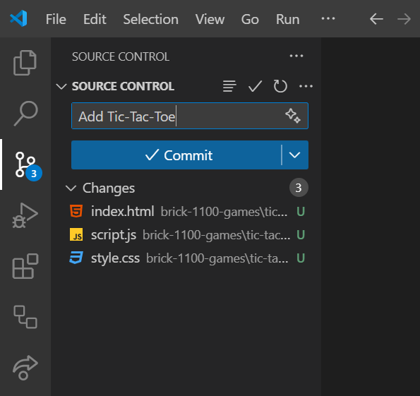
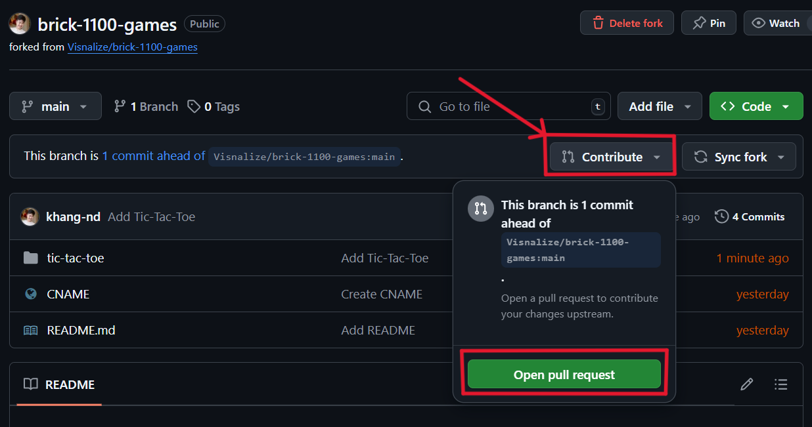

# Building a game for Brick 1100

:::tip Note
It is recommended to read the [Introduction](../builders.md) first to understand the background of Brick 1100, how it works, and the related tools before continuing with this guide.
:::

In this guide, let's build a simple __Tic Tac Toe__ game and get it running on [Brick 1100](../about.md).

In this Tic Tac Toe game, 2 players can play against each other on a 3x3 grid. One player is assigned the `X` symbol, and the other is assigned the `O` symbol. The player who succeeds in placing three of their marks in a horizontal, vertical, or diagonal row wins the game.

<!-- Below is a preview of the final game:

<video playsinline autoplay loop muted controls :class="$style.video">
    <source src="./img/tic-tac-toe.mp4" type="video/mp4">
</video> -->

<SponsorAd />

## 1. Setup

### 1.1. Tool

- Install [Visual Studio Code](https://code.visualstudio.com/) on your device.
  - This is the recommended code editor for this guide.
- Install the [Live Server](https://marketplace.visualstudio.com/items?itemName=yandeu.five-server) extension in Visual Studio Code.
  - This extension will help you to run your game locally and see the changes in real-time.
- After the above steps, you should see a `Go Live` button at the bottom right corner of Visual Studio Code.


### 1.2. Codebase

- Create a [GitHub](https://github.com/) account if you don't have one.
- Fork the [Brick 1100 Games](https://github.com/Visnalize/brick-1100-games) directory repository to your account.
  - This repository contains the source code of all games built for Brick 1100. Your game will be added to this repository upon completion.


- Clone the forked repository to your Visual Studio Code:
  - Copy the repository URL as shown in the below screenshot.
  
  - In Visual Studio Code, open the terminal (select `View > Terminal` from the menu or press <code>Ctrl + `</code>) and run the following command:

    ```bash
    git clone <repo_url>
    ```

  - Replace `<repo_url>` with the copied URL, e.g. `https://github.com/<username>/brick-1100-games.git`.

- Once the repository is cloned, you will see the source code in your Visual Studio Code.

<SponsorAd />

## 2. Build

- In your Visual Studio Code, create a new folder named `tic-tac-toe` inside the `brick-1100-games` folder. This folder will contain the source code of the Tic Tac Toe game.
- Start the Live Server by selecting the `tic-tac-toe` folder, right-clicking, and selecting `Open with Five Server (root)`.


- A new browser tab with the URL `http://127.0.0.1:5500` will open, now every change you make to this folder will be reflected in real-time.

### 2.1. Game structure (HTML file)

- Create an `index.html` file inside the `tic-tac-toe` folder with the below content:

```html:line-numbers {8,9,19}
<!DOCTYPE html>
<html lang="en">

<head>
    <meta charset="UTF-8">
    <meta name="viewport" content="width=device-width, initial-scale=1.0">
    <title>Tic-Tac-Toe</title>
    <link rel="stylesheet" href="https://unpkg.com/bridge-1100/dist/index.css">
    <link rel="stylesheet" href="https://unpkg.com/bridge-1100/dist/font.css">
    <link rel="stylesheet" href="style.css">
</head>

<body>
    <div id="container">
        <div id="board"></div>
        <div id="result" hidden></div>
    </div>

    <script src="https://unpkg.com/bridge-1100/dist/index.umd.js"></script>
    <script src="script.js"></script>
</body>

</html>
```

- The game consists of two screens:
  1. The first screen displays the Tic Tac Toe board.
  2. The second screen displays the result of the game.
- Note the highlighted lines:
  - Line 8 and 9: these are links to the [Bridge 1100](../builders.md#bridge-1100) CSS and fonts files, they help enforce your app's interface to fit seamlessly with Brick 1100's monochrome visual.
  - Line 19: this is a link to the Bridge 1100 JavaScript file, it helps bridge the communication between your app and Brick 1100.

:::danger [Best practice](./best-practices.md)
__Bridge 1100__ should be used in your game to maintain the visual consistency of your game with Brick 1100 and to ensure the game works correctly without having to invent the communication logic between your game and Brick 1100.
:::

### 2.2. Game logic (JS file)

- Create a `script.js` file inside the `tic-tac-toe` folder. In this file, we will write the logic for the Tic Tac Toe game.
- From the HTML structure above, we retrieve the input and output elements:

```js
var board = document.getElementById('board');
var result = document.getElementById('result');
```

- Then, we define the game-related variables:

```js
var currentPlayer = "X"; // X starts first
var gridSize = 3; // the grid size of 3x3
var gameState = Array(gridSize * 3).fill(null); // the game state to keep track of the moves
var cursor = [0, 0]; // the cursor position
```

- We also define the winning conditions for the game:

```js
var winningConditions = [
    [0, 1, 2], [3, 4, 5], [6, 7, 8], // horizontal
    [0, 3, 6], [1, 4, 7], [2, 5, 8], // vertical
    [0, 4, 8], [2, 4, 6] // diagonal
];
```

- Next, for the game logic, we define the following functions:
  - `init`: initializes/resets the game board and state.
  - `markCell`: marks the cell with the current player's symbol, and checks for game results.
  - `hasWinner`: checks if the current player has won the game.
  - `showResult`: displays the game result screen.
- The implementation of these functions is as follows:

```js
function init() {
  board.innerHTML = "";
  board.hidden = false;
  result.hidden = true;
  currentPlayer = "X";
  gameState.fill(null);
  cursor = [0, 0];

  // populate board
  for (var i = 0; i < gameState.length; i++) {
    var cell = document.createElement("div");
    if (i === 0) cell.classList.add("active");
    cell.classList.add("cell");
    cell.dataset.index = i;
    board.appendChild(cell);
  }
}

function markCell() {
  var cells = document.querySelectorAll(".cell");
  var index = cursor[0] * gridSize + cursor[1];

  if (gameState[index]) return;

  gameState[index] = currentPlayer;
  cells[index].textContent = currentPlayer;

  var allCellsFilled = gameState.every(function (cell) {
    return cell !== null;
  });

  if (hasWinner()) {
    showResult(currentPlayer + " wins!");
  } else if (allCellsFilled) {
    showResult("It's a draw!");
  } else {
    currentPlayer = currentPlayer === "X" ? "O" : "X";
  }
}

function hasWinner() {
  return winningConditions.some(function (combination) {
    return combination.every(function (index) {
      return gameState[index] === currentPlayer;
    });
  });
}

function showResult(message) {
  result.textContent = message + " Press 0 to restart.";
  result.hidden = false;
  board.hidden = true;
}
```

- The last piece to chain everything together is to handle the user input. We listen for the `keypress` and `numpress` events using [Bridge 1100](../builders.md#bridge-1100) to move the cursor and mark the cell:

```js
window.bridge.on("keypress", handleKeyPress);
window.bridge.on("numpress", handleKeyPress);

function handleKeyPress(key) {
  if (key === 0) init();
  if (key === 5 || key === "ok") markCell();
  if (key === 2) moveCursor("up");
  if (key === 4) moveCursor("left");
  if (key === 6) moveCursor("right");
  if (key === 8) moveCursor("down");
  if (key === "up") moveCursor("prev");
  if (key === "down") moveCursor("next");
  if (key === "clear") window.bridge.send(window.parent, { event: "stop" });
}
```

- The `moveCursor` function is implemented as follows:

```js
function moveCursor(direction) {
  var cells = document.querySelectorAll(".cell");
  var row = cursor[0];
  var col = cursor[1];
  var cell = cells[row * gridSize + col];
  cell.classList.remove("active");

  if (direction === "up") row = (row - 1 + gridSize) % gridSize;
  if (direction === "down") row = (row + 1) % gridSize;
  if (direction === "left") col = (col - 1 + gridSize) % gridSize;
  if (direction === "right") col = (col + 1) % gridSize;
  if (direction === "prev") {
    row = col === 0 ? (row - 1 + gridSize) % gridSize : row;
    col = (col - 1 + gridSize) % gridSize;
  }
  if (direction === "next") {
    col = (col + 1) % gridSize;
    row = col === 0 ? (row + 1) % gridSize : row;
  }

  cursor = [row, col];
  cell = cells[row * gridSize + col];
  cell.classList.add("active");
}
```

- Let's break down the `moveCursor` implementation:
  - First, the `active` class is removed from the current cell.
  - The new cursor position is calculated based on the direction:
    - `up`/`down`: calculates the new row position.
    - `left`/`right`: calculates the new column position.
    - `prev`/`next`: calculates both the row and column positions.
  - The cursor position is then updated based on the calculated row/column positions.
  - Finally, the `active` class is added to the new cell based on the updated cursor position.
- Putting it all together, the `script.js` file should look like this:

:::details Click to open

```js
var board = document.getElementById("board");
var result = document.getElementById("result");

var currentPlayer = "X";
var gridSize = 3;
var gameState = Array(gridSize * 3).fill(null);
var cursor = [0, 0];

var winningConditions = [
  [0, 1, 2],
  [3, 4, 5],
  [6, 7, 8],
  [0, 3, 6],
  [1, 4, 7],
  [2, 5, 8],
  [0, 4, 8],
  [2, 4, 6],
];

function init() {
  board.innerHTML = "";
  board.hidden = false;
  result.hidden = true;
  currentPlayer = "X";
  gameState.fill(null);
  cursor = [0, 0];

  // populate board
  for (var i = 0; i < gameState.length; i++) {
    var cell = document.createElement("div");
    if (i === 0) cell.classList.add("active");
    cell.classList.add("cell");
    cell.dataset.index = i;
    board.appendChild(cell);
  }
}

function moveCursor(direction) {
  var cells = document.querySelectorAll(".cell");
  var row = cursor[0];
  var col = cursor[1];
  var cell = cells[row * gridSize + col];
  cell.classList.remove("active");

  if (direction === "up") row = (row - 1 + gridSize) % gridSize;
  if (direction === "down") row = (row + 1) % gridSize;
  if (direction === "left") col = (col - 1 + gridSize) % gridSize;
  if (direction === "right") col = (col + 1) % gridSize;
  if (direction === "prev") {
    row = col === 0 ? (row - 1 + gridSize) % gridSize : row;
    col = (col - 1 + gridSize) % gridSize;
  }
  if (direction === "next") {
    col = (col + 1) % gridSize;
    row = col === 0 ? (row + 1) % gridSize : row;
  }

  cursor = [row, col];
  cell = cells[row * gridSize + col];
  cell.classList.add("active");
}

function hasWinner() {
  return winningConditions.some(function (combination) {
    return combination.every(function (index) {
      return gameState[index] === currentPlayer;
    });
  });
}

function showResult(message) {
  result.textContent = message + " Press 0 to restart.";
  result.hidden = false;
  board.hidden = true;
}

function markCell() {
  var cells = document.querySelectorAll(".cell");
  var index = cursor[0] * gridSize + cursor[1];

  if (gameState[index]) return;

  gameState[index] = currentPlayer;
  cells[index].textContent = currentPlayer;

  var allCellsFilled = gameState.every(function (cell) {
    return cell !== null;
  });

  if (hasWinner()) {
    showResult(currentPlayer + " wins!");
  } else if (allCellsFilled) {
    showResult("It's a draw!");
  } else {
    currentPlayer = currentPlayer === "X" ? "O" : "X";
  }
}

function handleKeyPress(key) {
  if (key === 0) init();
  if (key === 5 || key === "ok") markCell();
  if (key === 2) moveCursor("up");
  if (key === 4) moveCursor("left");
  if (key === 6) moveCursor("right");
  if (key === 8) moveCursor("down");
  if (key === "up") moveCursor("prev");
  if (key === "down") moveCursor("next");
  if (key === "clear") window.bridge.send(window.parent, { event: "stop" });
}

init();

window.bridge.on("keypress", handleKeyPress);
window.bridge.on("numpress", handleKeyPress);
```

:::

:::tip [Best practice](./best-practices.md)
When writing game logic with JS, it is recommended to use the __ES5 syntax__ to ensure your game works on a wider range of devices, especially older devices that may not have the latest JavaScript features.
:::

<SponsorAd />

### 2.3. Game assets <Badge text="optional" type="info" />

To make the game more engaging, let's add some audio assets.

- Create an `audio` folder inside the `tic-tac-toe` folder.
- Add the following audio files to the `audio` folder:
  - `pop.mp3`: a sound effect when a player marks a cell.
  - `over.mp3`: a sound effect when a player wins the game.
- Modify the `script.js` to include the audio handling logic:

```js
function playAudio(audioId) { // [!code ++]
  window.bridge.send(window.parent, { event: "playAudio", data: audioId }); // [!code ++]
} // [!code ++]

function markCell() {
  // some code...
  
  if (hasWinner()) {
    showResult(currentPlayer + " wins!");
    playAudio("over"); // [!code ++]
  } else if (allCellsFilled) {
    showResult("It's a draw!");
  } else {
    currentPlayer = currentPlayer === "X" ? "O" : "X";
    playAudio("pop"); // [!code ++]
  }
}

// some code...

window.bridge.on("keypress", handleKeyPress);
window.bridge.on("numpress", handleKeyPress);
window.bridge.send(window.parent, { // [!code ++]
  event: "loadAudio", // [!code ++]
  data: ["pop.mp3", "over.mp3"].map(function (src) { // [!code ++]
    return location.origin + "/tic-tac-toe/audio/" + src; // [!code ++]
  }), // [!code ++]
}); // [!code ++]
```

- The above code does the following:
  - The `loadAudio` event is sent to Brick 1100 to load the audio files before playing them.
  - The `playAudio` function plays the audio from the provided audio ID, either when a cell is marked or when the game has a winner.

:::danger [Best practice](./best-practices.md)
The audio URLs must be __absolute__ URLs, meaning they must start with `https://` and include the full path to the audio files. This is to ensure the audio files are loaded correctly on Brick 1100.
:::

### 2.4. Game styling (CSS file)

- Create a `style.css` file inside the `tic-tac-toe` folder with the below content:

```css
#container {
  display: flex;
  justify-content: center;
  align-items: center;
  height: 100%;
}

#board:not([hidden]) {
  display: grid;
  grid-template-columns: repeat(3, 1fr);
  width: 94vh;
  margin: auto;
  border: 1vh solid var(--c-black);
}

.cell {
  width: 100%;
  height: 30vh;
  border: 1vh solid var(--c-black);
  display: flex;
  justify-content: center;
  align-items: center;
  box-sizing: border-box;
}

.cell.active {
  background: var(--c-black);
  color: var(--c-trans);
}

#result {
  text-align: center;
  font-size: 20vh;
}
```

:::danger [Best practice](./best-practices.md)
Ensure your game's styling is __consistent__ with Brick 1100's visual as much as possible. This decides whether your game will be accepted or rejected during the review process.
:::

### 2.5. Preview your game <Badge text="optional" type="info" />

> _See main guide: [Using Brick 1100 Previewer](./using-previewer.md)_

## 3. Publish

### 3.1. Commit and push

- In your Visual Studio Code, switch to the Source Control view on the left sidebar.
- Stage all changes by clicking the `+` button next to the files.
- Write a concise commit message in the text box and click the `Commit` button.



### 3.2. Open a pull request

- Open your forked repository on GitHub from step 1.2.
- Click `Contribute > Open pull request`. This will create a pull request to merge your changes into the directory repository.



- On the pull request page, you can also preview your game again with the Netlify preview deployment link provided.
  - Note: append your game's folder path in the preview URL to access it, e.g. `https://deploy-preview-1--brick1100-games.netlify.app/tic-tac-toe/`.


- 🎉 And that's it! Your game is now ready for review and will be available on Brick 1100 immediately once approved.

<style module>
.video {
  max-width: 200px;
  margin: auto;
}
</style>
