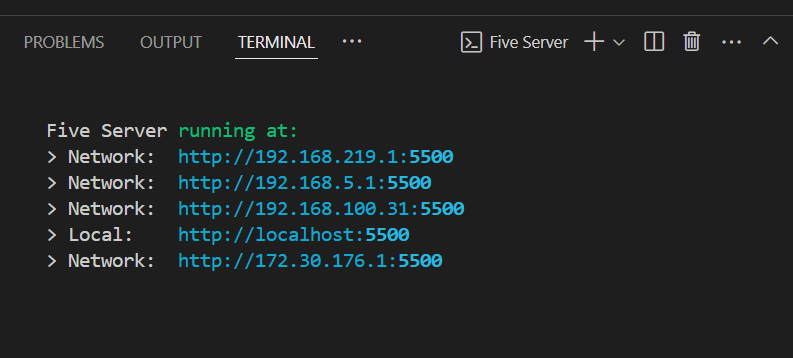

# Using Brick 1100 Previewer

After building your app/game, it's possible to see how it looks and works on [Brick 1100](../about.md). In this guide, let's see how we can achieve this.

## 1. Prerequisites

- Your app/game is built using [Bridge 1100](../builders.md#bridge-1100).
- Your app/game is running on a local server.



<SponsorAd />

## 2. Expose your app/game to the internet

For this, we will use [localhost.run](https://localhost.run/), a tool that creates a tunnel to your local server, allowing you to expose your app/game to the internet.

- Open a terminal and run the command below:

```text
ssh -R 80:127.0.0.1:<port_number> nokey@localhost.run
```

Replace `<port_number>` with `5500` if you are running your app/game with [Live Server](https://marketplace.visualstudio.com/items?itemName=yandeu.five-server).

- The below information will be displayed in the terminal.

```text{28}
Microsoft Windows [Version 10.0.19045.5247]
(c) Microsoft Corporation. All rights reserved.

C:\brick-1100-apps>ssh -R 80:127.0.0.1:5500 nokey@localhost.run // [!code focus]

===============================================================================
Welcome to localhost.run!

Follow your favourite reverse tunnel at [https://twitter.com/localhost_run].

To set up and manage custom domains go to https://admin.localhost.run/

More details on custom domains (and how to enable subdomains of your custom
domain) at https://localhost.run/docs/custom-domains

If you get a permission denied error check the faq for how to connect with a key or
create a free tunnel without a key at [http://localhost:3000/docs/faq#generating-an-ssh-key].

To explore using localhost.run visit the documentation site:
https://localhost.run/docs/

===============================================================================

** your connection id is 02a4a127-6c8c-49e5-8716-e8d58cfbf1af, please mention it if you send me a message 
about an issue. **

authenticated as anonymous user
1b3d6c557fb368.lhr.life tunneled with tls termination, https://1b3d6c557fb368.lhr.life // [!code focus]
create an account and add your key for a longer lasting domain name. see https://localhost.run/docs/forever-free/ for more information.
```

- Copy the URL displayed in the terminal, e.g. `https://***.lhr.life`. This is the public URL to your app/game.

## 3. Use Brick 1100 Previewer

- Go to [Brick 1100 Previewer](https://brick1100.visnalize.com/#/online/previewer).
- Append the public URL from the above step at the end of the Previewer's URL.
  For example: `https://brick1100.visnalize.com/#/online/previewer?url=https://***.lhr.life`.
- And that's it! Your app/game should then be loaded into Brick 1100. You can now interact with it and test its functionality.
